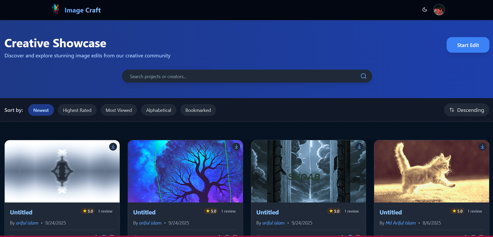

# ImageCraft

An advanced real time web application using **GPU** for editing, enhancing, and sharing images.  
Built with **React (Vite)** on the frontend and **Flask** on the backend, with cloud storage using Cloudinary and subscription-based payment with **Stripe**.

You can find the project demo [here](https://pixeltune-theta.vercel.app/). As it is a free service, backend may not work.

---

## ✨ Features

### 🔑 Authentication

- Email/password signup & login
- Google OAuth login
- JWT-based authentication

### 🖌️ Image Editing Tools

- Supports Any Image Size From Local Disk, Online URL, Canvas JSON File
- Adjust Colors, Details of the image
- Custom Preset Filters
- Reflect, Swirl, Bulge/Pinch Filters, Histogram Equalization, Contrast Stretching
- Add **text** and **shapes**
- Preset Text Templates
- **Crop** and **resize**
- **Style transfer** (with templates & any image)
- **Super resolution** (upscaling)
- **Undo/Redo Feature**

  
  
Figure: Main Editing Page

  
  
Figure: Color Filters

  
  
Figure: Style Transfer

  
  
Figure: 2X, 3X, 4X Super Resolution

### 📊 User Dashboard

- Users Projects
- Bookmarks
- Manage Subscriptions
- Reports & Notices
- Access Project Information Dashboard

  
  
Figure: Profile Page

  
  
Figure: Project Dashboard

### 📸 Gallery

- Share edited images with the community
- Sort by **bookmarks** and **views**
- **Like** / **rate** images
- **Report** inappropriate content
- Pagination

  
  
Figure: Gallery

**TODO**: **Find similar images using semantic search**

### 👨‍💻 Admin Dashboard

- Review and manage reported images
- Manage Admins
- Add New Text and Style Transfer Templates

  
  
Figure: Admin Management

  
  
Figure: Add Templates

### 💳 Subscription System

- **Stripe integration** for subscription plans
- Webhooks to:
  - Update subscription plans
  - Subscription Cancellations
  - Reset user quotas (`style_completion` and `upscale_completion`)

  
  
Figure: Pricing

  
  
Figure: Stripe Subscription

  
  
Figure: Current Plan

---

## 🛠️ Tech Stack

- **Frontend:** React (Vite), TailwindCSS, Fabric.js, WebGL
- **Backend:** Flask
- **Database:** MongoDB
- **Storage:** Cloudinary
- **Auth:** JWT + Google OAuth
- **Payments:** Stripe
- **Deployment:** Vercel, Render

 

# LICENSE

[MIT LICENSE](LICENSE)
